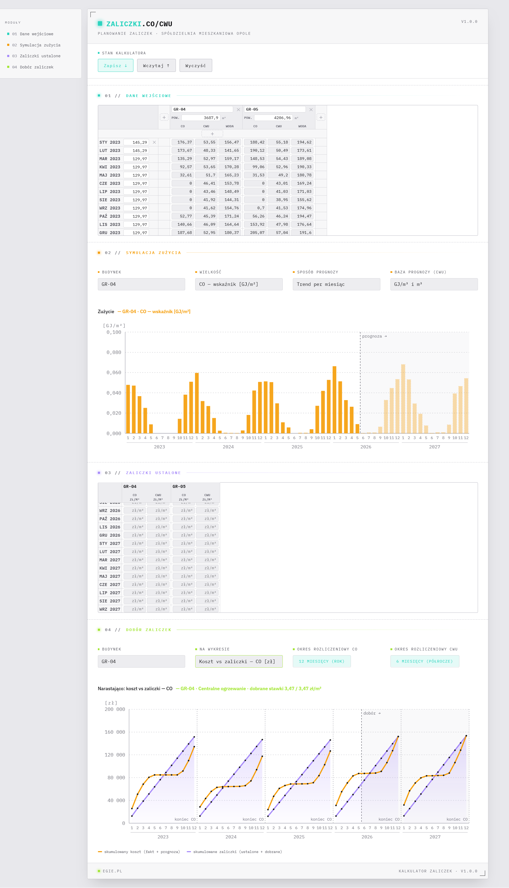

# Kalkulator zaliczek CO/CWU — v1.0.0

Planowanie miesięcznych zaliczek na centralne ogrzewanie (CO) i ciepłą wodę
użytkową (CWU) dla budynków spółdzielni mieszkaniowej. Uruchamiany z `file://`
(bez serwera, bez frameworka).

## Uruchomienie

Otwórz `kalkulator-zaliczek.v1.0.html` w przeglądarce. Folder `css/` i `js/`
muszą leżeć obok pliku HTML.

## Architektura

- **Czysty HTML/CSS/JS** — bez buildu, bez `npm`, bez frameworka i bez zewnętrznych
  bibliotek JS. Wykresy to ręcznie generowany SVG; jedyna zależność zewnętrzna to
  font z Google Fonts (kosmetyka). Całość działa offline, prosto z dysku.
- **Brak ES modules** (Chrome blokuje `import/export` na `file://`) — zamiast tego
  każdy plik JS to IIFE rozszerzające jeden wspólny namespace `window.KZ`. Skrypty
  ładują się w **sztywnej kolejności** (`config → data → estimate → persist →
  render → render.mXX → app`; zob. koniec pliku HTML).
- **Jedno źródło prawdy UI** — `KZ.state` trzyma wyłącznie ustawienia interfejsu;
  dane domenowe leżą osobno w magazynach `records`/`prices`/`advances`/`areas`,
  dzięki czemu łatwo serializują się do JSON.
- **Przepływ danych** — każda zmiana w UI woła `KZ.update()`, które przelicza
  symulację i renderuje wszystkie moduły. Listenery podpięte przez delegację
  zdarzeń na stabilnych kontenerach (tabele przerysowywane przez `innerHTML`).

## Struktura

```
css/                            kolejność ładowania w HTML: tokens → layout → components
  kz.components.css             komponenty (macierze, wykresy, przyciski)
  kz.layout.css                 layout (nagłówek, moduły, kontrolki, stopka)
  kz.tokens.css                 zmienne (kolory, odstępy) — motyw jasny
js/                             kolejność ładowania w HTML: config → data → estimate → persist → render → render.mXX → app
  kz.app.js                     orkiestracja: update(), init(), listenery
  kz.config.js                  namespace KZ, stałe, P.state
  kz.data.js                    magazyny records/prices/advances + CRUD
  kz.estimate.js                prognoza zużycia, simulate(), metricMatrix()
  kz.persist.js                 eksport/import JSON + autosave
  kz.render.js                  wspólne helpery (formatery, szkielet SVG)
  kz.render.m01.js              Moduł 01 — macierz danych
  kz.render.m02.js              Moduł 02 — zużycie (8 wielkości)
  kz.render.m03.js              Moduł 03 — macierz stawek zaliczek
  kz.render.m04.js              Moduł 04 — dobór zaliczek
docs/
  screenshot.png               zrzut ekranu (sekcja na końcu)
import/
  import_gr4_gr5.json          przykładowe dane (budynki GR-04/GR-05) do wczytania
CLAUDE.md                        wskazówki dla Claude Code przy edycji repo
kalkulator-zaliczek.v1.0.html   strona główna (na końcu pliku — kolejność <script>)
README.md                        ten plik
```

## Model danych (serializowany do JSON)

Przykładowy plik (skrócony — po jednym wpisie na magazyn):

```jsonc
{
  // pomiary zużycia, po jednym na budynek×medium×miesiąc
  "records": [
    {
      "id": "GR-04|CO|2023|1",          // klucz: budynek|medium|rok|miesiąc
      "building": "GR-04",              // identyfikator budynku
      "medium": "CO",                   // CO = ogrzewanie, CWU = ciepła woda
      "year": 2023,                     // rok pomiaru
      "month": 1,                       // miesiąc pomiaru (1–12)
      "gj": 152.4,                      // zużyta energia [GJ]
      "qty": 3120                       // CO: powierzchnia [m²]
    },
    {
      "id": "GR-04|CWU|2023|1",         // klucz: budynek|medium|rok|miesiąc
      "building": "GR-04",              // identyfikator budynku
      "medium": "CWU",                  // CO = ogrzewanie, CWU = ciepła woda
      "year": 2023,                     // rok pomiaru
      "month": 1,                       // miesiąc pomiaru (1–12)
      "gj": 38.7,                       // zużyta energia [GJ]
      "qty": 410                        // CWU: zużycie wody [m³]
    }
  ],
  // cena ciepła [zł/GJ], klucz "RRRR-MM" (wspólna dla budynków)
  "prices": {
    "2023-01": 78.5                     // styczeń 2023 [zł/GJ]
  },
  // stawki jednostkowe zaliczek, klucz "budynek|medium|RRRR-MM"
  "advances": {
    "GR-04|CO|2023-01": 1.85,           // CO [zł/m²]
    "GR-04|CWU|2023-01": 22.4           // CWU [zł/m³]
  },
  // powierzchnia budynku [m²] (sync z qty rekordów CO)
  "areas": {
    "GR-04": 3120                       // GR-04 [m²]
  }
}
```

Dane wprowadza się w Module 01 jako **tabelę**: wiersze to kolejne miesiące,
kolumny to budynki. W każdej komórce podaje się trzy liczby — GJ‑CO, GJ‑CWU i m³
wody — które trafiają do magazynu `records`, a powierzchnię budynku (m²) wpisuje
się raz, w nagłówku jego kolumny, skąd zasila magazyn `areas`. Tabelę można
dowolnie rozszerzać: dodawać puste budynki i miesiące.

Pozostałe dwa magazyny wypełnia się gdzie indziej. **Cena ciepła** (`prices`)
jest jedna na miesiąc — wspólna dla wszystkich budynków — więc wpisuje się ją
raz na wiersz, również w Module 01. **Stawki zaliczek ustalonych** (`advances`)
podaje się w Module 03, w tabeli o tym samym układzie co Moduł 01 (wiersze =
miesiące, kolumny = budynki): w każdej komórce stawka jednostkowa CO [zł/m²]
i CWU [zł/m³]. To te stawki, których kalkulator **nie zmienia** — traktuje je
jako narzucone z góry i dobiera tylko brakujący „ogon" późniejszych miesięcy
(Moduł 04).

## Algorytm zaliczek

Zaliczki liczone są **per budynek i medium**, na zakresie miesięcy z Modułu 01,
osobno dla każdego **okresu rozliczeniowego** (CO = rok / 12 mies., CWU =
półrocze / 6 mies.).

1. **Prognoza zużycia** dla pustego „ogona" miesięcy — z tego samego miesiąca
   kalendarzowego w poprzednich latach:
   - 0 próbek → miesiąc pomijany (brak symulacji),
   - 1 próbka → trend płaski równy tej wartości,
   - ≥2 próbki → regresja liniowa względem **roku** i ekstrapolacja.

   Dla **CWU** GJ można prognozować na dwa sposoby (przełącznik „Baza prognozy"
   w Module 02, `state.cwuBasis`): `'intensity'` — `trend(GJ/m³) × trend(m³)`,
   rozdzielający część fizyczną (energia na m³) od zachowania (zużycie wody)
   (domyślnie), lub `'gj'` — trend wprost na GJ. Dla **CO** wybór jest bez
   znaczenia (driver = stała powierzchnia, więc `trend(GJ/m²)×m² ≡ trend(GJ)`).
2. **Koszt miesiąca** = zużycie_GJ × cena_GJ(rok, miesiąc). Cena bez wpisu
   dziedziczy ostatnią znaną wcześniejszą (carry-forward; ECO ogłasza taryfy
   z wyprzedzeniem — można je wpisać).
3. **Zaliczki ustalone (Moduł 03).** Stawka **jednostkowa** wpisana ręcznie
   w macierzy M03 (CO: zł/m², CWU: zł/m³). Miesięczna zaliczka = `stawka × driver`,
   gdzie driver to powierzchnia budynku (CO) lub zużycie wody danego miesiąca (CWU).
   Dziura między wpisanymi stawkami dziedziczy stawkę wcześniejszą (carry-forward).
4. **Zaliczki dobierane (Moduł 04).** Pusty „ogon" po ostatniej wpisanej stawce
   dostaje **jedną stałą stawkę na każdy okres rozliczeniowy**, tak by saldo
   (zaliczki − koszt) zeszło do zera **na końcu KAŻDEGO okresu**:
   `stawka_okresu = max(0, (Σkoszt_okresu − Σzaliczki_ustalone_okresu) / Σdriver_ogona_okresu)`.
   Nadwyżka z okresów historycznych (gdy ustalone zaliczki przewyższały koszt)
   **nie jest odrabiana** w kolejnych okresach — wraca do lokatorów jako zwrot
   za dany okres. Skumulowany wykres koszt vs zaliczki (Moduł 04) **resetuje się
   na granicy każdego okresu** → kształt „ząbków".

## Założenia (łatwe do zmiany)

- **Okres rozliczeniowy:** CO = 12 mies., CWU = 6 mies. Start okresu konfigurowalny
  w `state.periodStartCO` / `periodStartCWU` (domyślnie styczeń → CO: I–XII;
  CWU: I–VI / VII–XII). Bilansowanie jest **per okres** — każdy okres domyka saldo
  osobno (zob. krok 4 algorytmu).
- **Przeszłość vs przyszłość:** miesiąc bez rekordu to „ogon" prognozy (liczony
  trendem); zaliczki ustalone (M03) są nienaruszalne, dobierany jest tylko pusty
  ogon po ostatniej wpisanej stawce.
- **Zaliczka per budynek** (nie per lokal). Alokacja na lokale (CWU wg m³, CO wg m²)
  do dodania w kolejnej iteracji.
- **Baza prognozy CWU:** domyślnie `'intensity'` (`trend(GJ/m³) × trend(m³)` — rozdziela
  energię na m³ od zużycia wody); przełącznik „Baza prognozy" w Module 02 pozwala wrócić
  do `'gj'` (trend wprost na GJ). Dla CO bez znaczenia (driver = stała powierzchnia).
- **Trwałość:** główny mechanizm to eksport/import pliku JSON (Zapisz/Wczytaj/Wyczyść
  w górnym pasku); dodatkowo best-effort autosave w `localStorage`.

## Świadomie pominięte

Alokacja na poszczególne lokale, wybór wielu metod estymacji (jest jedna: trend),
margines bezpieczeństwa (%). Wszystko łatwe do dołożenia w architekturze KZ.

## Zrzut ekranu


